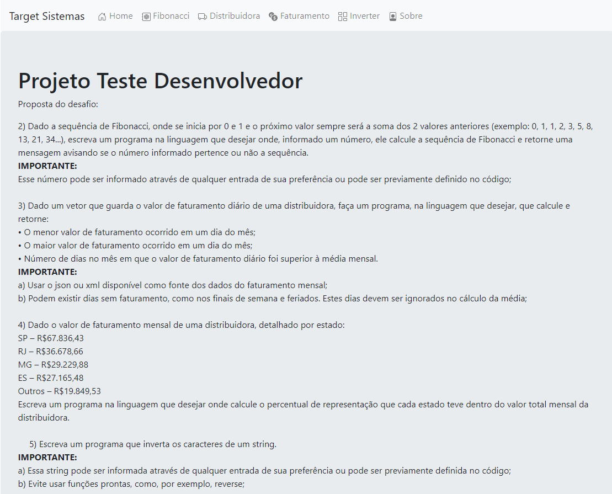
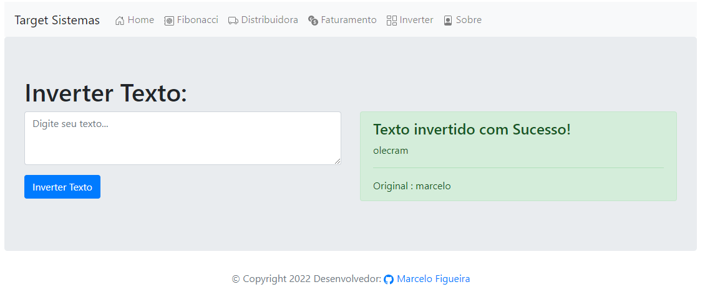
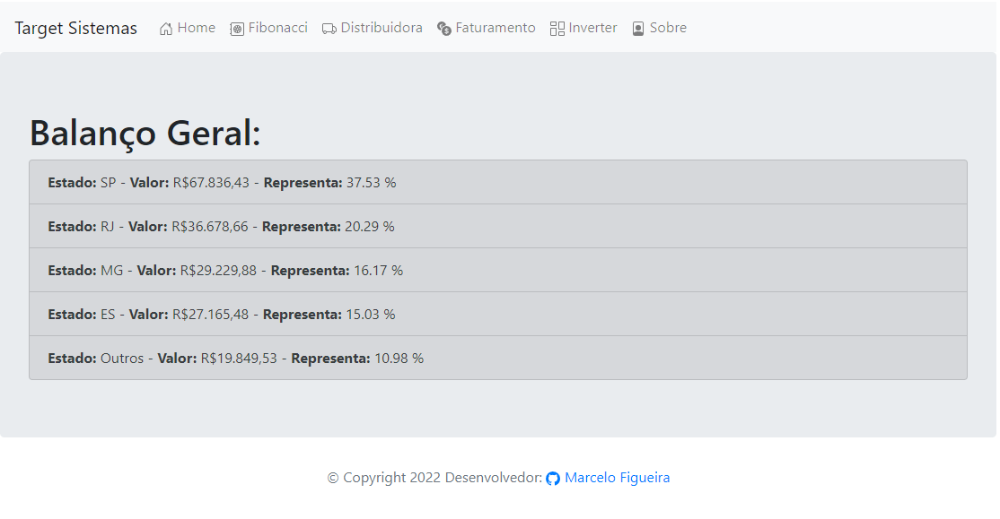
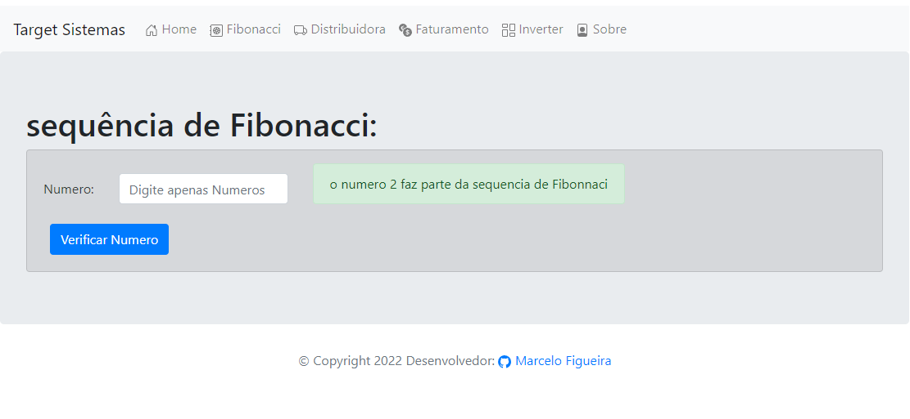

# Teste Desenvolvedor

esse é o repositorio para o teste para vaga de desenvolvedor.

## 🚀 Começando

Essas instruções permitirão que você obtenha uma cópia do projeto em operação na sua máquina local para fins de desenvolvimento e teste.

Consulte **Implantação** para saber como implantar o projeto.

### 🔧 Instalação

Para instalar o projeto, basta clonar o repositorio, e em seguida da os seguintes comandos:

Instalar as bibliotecas:

```
npm install
```

Inicie o projeto:

```
npm run dev
```

agora basta entrar na url http://localhost:3000/.

## 🛠️ Construído com

Foi usado as seguintes Tecnologias nesse projeto:

- [NodeJs](https://nodejs.org/en/) - Linguagem Back End.
- [TypeScript](https://www.typescriptlang.org/) - Typescript para tipagem.
- [Express](https://expressjs.com/pt-br/) - Express para sistema de rotas.
- [EJS](https://ejs.co/) - para implementação de interface front end.

## 📋 Fotos do projeto






## ✒️ Autores

- **Desenvolvedor** - _Trabalho completo_ - [Marcelo Figueira](https://github.com/marcelosousafigueira)

## 📄 Licença

Este projeto está sob a licença MIT - veja o arquivo [LICENSE.md](https://github.com/marcelosousafigueira/Teste_Desenvolvedor/blob/main/LICENSE) para detalhes.

## 🎁 Expressões de gratidão

- Conte a outras pessoas sobre este projeto 📢
- Convide alguém da equipe para uma cerveja 🍺
- Obrigado publicamente 🤓.
- etc.

---

⌨️ com ❤️ por [Armstrong Lohãns](https://gist.github.com/lohhans) 😊
